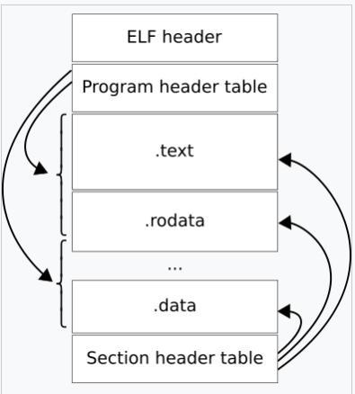

# 整体流程

汇编器 .s -> .o 

链接器 .o -> elf

我们实现64位RISCV静态链接器 ~~maybe~~

# ELF

Executable and Linkable Format


An ELF file has two views: the program header shows the segments used at run time, whereas the section header lists the set of sections.


ELF header

查看ELF文件
``` shell
    hexdump -C -n 8 file.o

    readelf --help
```

file data:
1. Program header table
2. Section header table
3. Data referred

# Linker 实现

读取并解析 ELF 文件

FileTypeArchive

input.hpp   ReadFile